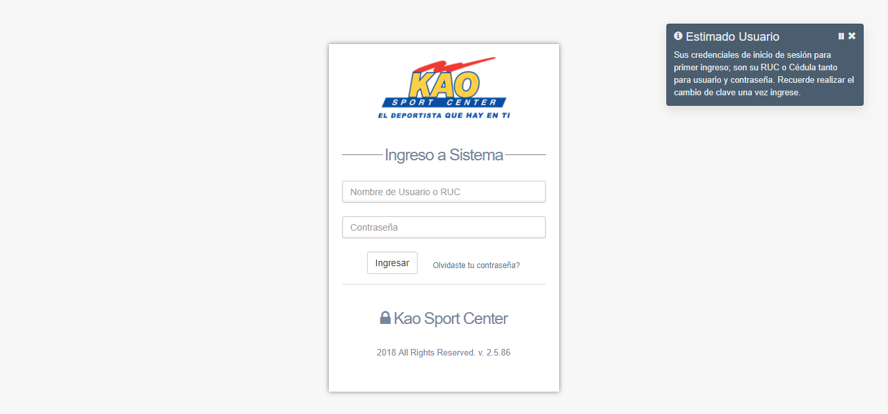

### Current Version : v2.85.0

## CSS Requirements:
- Gentelella - Bootstrap Admin Template. ( https://github.com/puikinsh/gentelella )
- Agregar todos los assets de 3eros del Admin Template a la carpeta assets del proyecto.

## Supported Browsers:
Chrome 35+, Firefox 31+, Safari 7+, IE 10+

## Quickstart:
- Descomprimir o clonar proyecto en directorio de servidor apache con php 5.5 o superior.
- Cargar el archivo SQL para generar las tablas y evitar errores de conexion.
- Editar las credenciales de conexion a la DB en el archivo .\core\models\conexion.php 
- Revisar ruta del directorio de carga de documentos PDF y XML por defecto son docwf/pdf y docwf/xml (el directorio para la carga FTP de los archivos debe estar fuera del directorio del proyecto)
-

## Changelog

